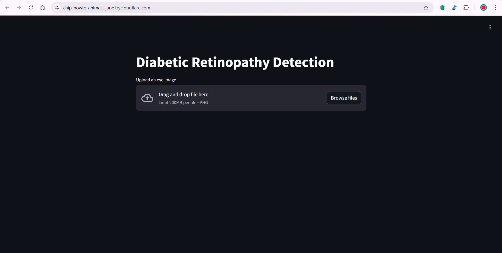

# Automated Detection of Diabetic Retinopathy

## Overview
Diabetic retinopathy (DR) is a severe complication of diabetes that can cause irreversible vision loss if not detected early. This project presents an automated DR detection system using deep learning techniques, specifically a Convolutional Neural Network (CNN) based on EfficientNet. The model classifies retinal images into different DR severity stages, helping healthcare professionals with early screening and diagnosis.

## Features
- **Deep Learning Model:** EfficientNet-based CNN for DR classification
- **Preprocessing:** Gaussian filtering, gamma correction, and image normalization
- **Training Dataset:** 80:20 split for training and validation
- **Deployment:** Web application using Streamlit
- **Secure Access:** Cloudflared integration for secure hosting

## Dataset
The model is trained on a curated dataset of 3,662 retinal images with five severity levels:
- **Level 0:** No DR
- **Level 1:** Mild DR
- **Level 2:** Moderate DR
- **Level 3:** Severe DR
- **Level 4:** Proliferative DR

## Model Architecture
- **Base Model:** EfficientNet
- **Input:** 224x224 RGB retinal images
- **Loss Function:** Categorical Cross-Entropy
- **Optimizer:** Adam
- **Performance Metrics:** Accuracy, Sensitivity, Specificity
- **Accuracy Achieved:** 94.48%

## Installation
### Prerequisites
Ensure you have Python 3.8+ installed along with the necessary libraries.

```bash
pip install -r requirements.txt
```

### Running the Model
1. Clone the repository:
```bash
git clone https://github.com/yourusername/diabetic-retinopathy-detection.git
cd diabetic-retinopathy-detection
```
2. Download and preprocess the dataset.
3. Train the model using:
```bash
python train.py
```
4. Start the web application:
```bash
streamlit run app.py
```

## Usage
1. Upload a retinal image via the web interface.
2. The model predicts the DR stage and displays confidence scores.
3. Results are shown on the dashboard for analysis.

## Deployment
The Streamlit app is integrated with Cloudflared for easy access and deployment. The interface allows healthcare professionals to securely analyze images without complex installations.

## Results
- **Accuracy:** 94.48%
- **Precision, Recall, and F1 Score:** Achieved high performance across all DR stages.
- **Comparison with Other Models:** EfficientNet outperforms traditional CNN architectures in efficiency and accuracy.

## Contributing
Contributions are welcome! Feel free to submit pull requests or report issues.

## License
This project is licensed under the MIT License.

## Acknowledgments
- Kaggle Diabetic Retinopathy Dataset
- TensorFlow & Keras for deep learning framework
- Streamlit for the web interface

## Screenshots

